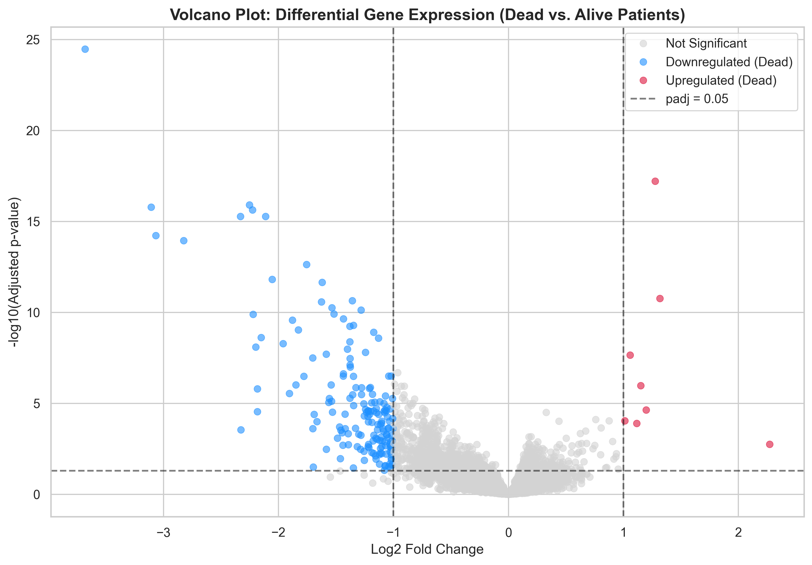
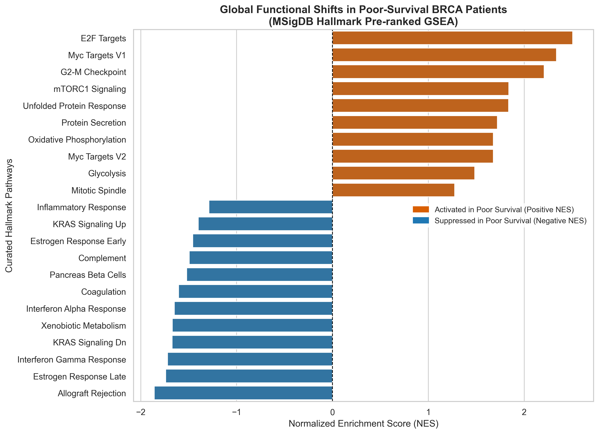
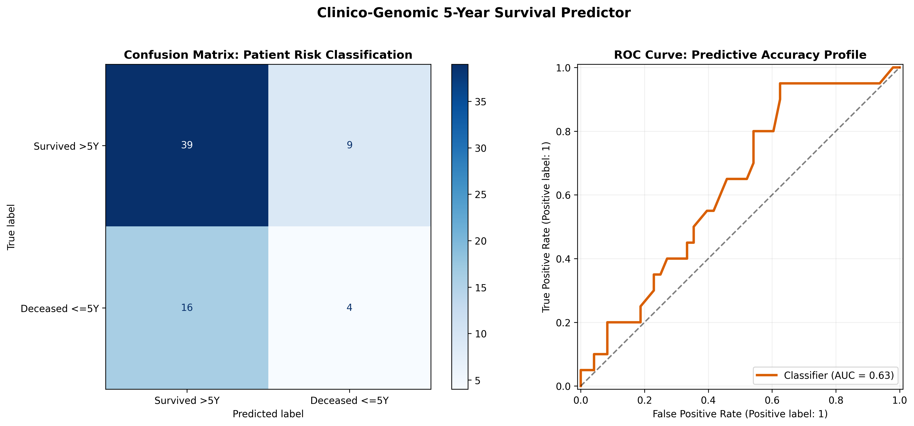
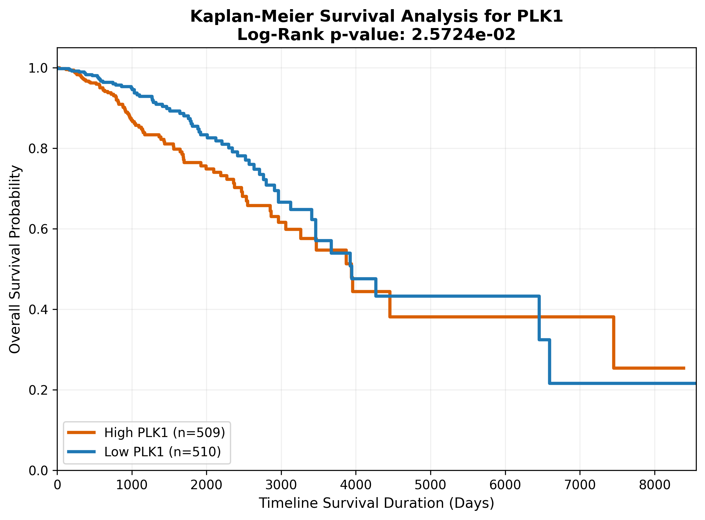

## Clinico-Transcriptomic Discovery of Prognostic Biomarkers and Functional Hallmarks in TCGA Breast Cancer Using Python

* **Dataset:** TCGA-BRCA (The Cancer Genome Atlas Breast Invasive Carcinoma)
* **Platform:** Illumina HiSeq High-Throughput RNA-Sequencing (RNA-Seq)
* **Cohort analyzed:** 1,019 Clinically Characterized Patient Sample Matrices

## Abstract

### Background

Breast cancer is a molecularly heterogeneous disease whose progression is driven by coordinated alterations in transcriptional regulation, cell proliferation, metabolism, immune signaling, and tissue architecture. Although numerous prognostic biomarkers have been reported, comparatively few studies integrate transcriptomic profiling, pathway-level interpretation, survival analysis, and predictive modeling within a single reproducible computational workflow.

### Methods

A comprehensive clinico-transcriptomic analysis pipeline was developed using RNA-seq and clinical data from 1,019 TCGA-BRCA patients. Raw sequencing counts underwent quality filtering and variance-stabilizing normalization prior to exploratory transcriptomic analysis. Differential gene expression was performed using a generalized linear model implemented in pyDESeq2 with Benjamini–Hochberg false discovery rate correction. Biological interpretation combined over-representation analysis (ORA) of significantly dysregulated genes with pre-ranked Gene Set Enrichment Analysis (GSEA) across the complete transcriptome. Prognostic significance was evaluated using Kaplan–Meier estimation, log-rank testing, and ridge-penalized Cox proportional hazards regression integrating transcriptomic and clinical treatment variables. Finally, a Random Forest classifier was trained on a derived 5-year survival endpoint to compare binary risk prediction against continuous time-to-event modeling.

### Results

Differential expression analysis identified a 176-gene survival-associated transcriptional signature, comprising 168 downregulated genes and 8 highly upregulated outliers. Functional enrichment analyses revealed coordinated activation of proliferative programs, including E2F Targets, G2/M Checkpoint, and MYC signaling, together with metabolic rewiring and suppression of interferon-mediated immune signaling and epithelial maintenance pathways. Kaplan–Meier analysis identified PLK1 (p = 0.0257) and MAD2L1 (p = 0.0262) as significant prognostic markers. Incorporating clinical treatment variables into a ridge-penalized Cox model improved predictive performance from a baseline concordance of 0.58 to 0.76, demonstrating the complementary prognostic value of molecular and clinical features. A Random Forest classifier achieved a moderate ROC-AUC of 0.63, with transcriptomic variables contributing approximately 85% of total feature importance, substantially exceeding the predictive contribution of treatment indicators.

### Conclusions

This study demonstrates that integrating transcriptomic profiling, functional pathway analysis, survival modeling, and machine learning provides a robust framework for investigating prognostic biomarkers in breast cancer. While binary classification offers complementary predictive insight, continuous time-to-event modeling captures substantially richer prognostic information, emphasizing the value of survival-based analytical frameworks for precision oncology and illustrating a fully reproducible Python workflow for clinico-genomic biomarker discovery.

---
## Key Analytical Outputs
<table>
  <tr>
    <td></td>
    <td></td>
    <td></td>
  </tr>
  <tr>
    <td></td>
    <td></td>
    <td></td>
  </tr>
</table>
---

## Key Highlights

* End-to-end reproducible Python pipeline for clinico-transcriptomic survival analysis
* Analysis of 1,019 TCGA-BRCA patient samples
* Identification of a 176-gene differential survival-associated expression signature
* Functional characterization via ORA and GSEA revealing 22 significant Hallmark pathways
* Ridge-penalized Cox model achieving Concordance index = 0.76
* Random Forest model showing ~85% feature importance contribution from transcriptomic variables

---

## Methods Snapshot

| Component                   | Method                                                          |
| --------------------------- | --------------------------------------------------------------- |
| RNA-seq preprocessing       | Low-count filtering + Variance Stabilizing Transformation (VST) |
| Differential expression     | Generalized Linear Model (pyDESeq2)                             |
| Multiple testing correction | Benjamini–Hochberg FDR                                          |
| Functional enrichment       | ORA + Pre-ranked GSEA (gseapy)                                  |
| Survival analysis           | Kaplan–Meier + Log-rank + Ridge-penalized Cox PH                |
| Machine learning            | Random Forest Classifier (class-balanced)                       |

---
## Pipeline Overview

This study implements a 6-stage computational pipeline, progressing from raw RNA-seq read processing to survival modeling and machine learning-based risk classification.

### Workflow Summary

**1. Data Preprocessing (Notebook 1)**

* TCGA-BRCA RNA-seq count matrix import and filtering (≥10 reads threshold)
* Clinical metadata curation and cohort harmonization (N = 1,019)

**2. Exploratory Analysis (Notebook 2)**

* Variance Stabilizing Transformation (VST) normalization
* Identification of Highly Variable Genes (HVGs)
* PCA revealing dominant global tissue structure over survival signal

**3. Differential Expression Analysis (Notebook 3)**

* GLM-based differential expression using pyDESeq2
* Benjamini–Hochberg FDR correction
* Identification of a 176-gene survival-associated signature (168 downregulated, 8 upregulated)

**4. Functional Enrichment (Notebook 4)**

* ORA on downregulated genes (gseapy.enrichr)
* Pre-ranked GSEA across full transcriptome (MSigDB Hallmark)
* Identification of 22 significantly dysregulated biological pathways

**5. Survival Modeling (Notebook 5)**

* Kaplan–Meier survival analysis with log-rank testing
* Cox proportional hazards modeling (baseline + treatment-adjusted)
* Ridge-penalized multivariate Cox model achieving Concordance = 0.76

**6. Machine Learning Classification (Notebook 6)**

* 5-year survival classification (N = 336, censored samples filtered)
* Random Forest classifier (class-balanced)
* ROC-AUC = 0.63 with ~85% feature importance driven by transcriptomic variables


## Repository Structure

```
brca-transcriptomic-ml-pipeline/
│
├── data/
│   ├── raw/
│   ├── processed/
│   └── manifest/
│
├── notebooks/
│   ├── 1_data_preprocessing.ipynb
│   ├── 2_exploratory_analysis.ipynb
│   ├── 3_differential_expression.ipynb
│   ├── 4_pathway_enrichment.ipynb
│   ├── 5_survival_analysis.ipynb
│   └── 6_ml_classification.ipynb
│
├── results/
│   ├── figures/
│   └── tables/
│
├── requirements.txt
└── README.md
```

---

## Reproducibility

```bash
git clone https://github.com/username/brca-transcriptomic-ml-pipeline.git
cd brca-transcriptomic-ml-pipeline

conda create --name rnaseq_env python=3.10 -y
conda activate rnaseq_env

pip install -r requirements.txt
```

---

## Limitations

* Retrospective observational design; no external cohort validation performed
* Binary 5-year survival labeling introduces temporal information loss
* Bulk RNA-seq data does not resolve cell-type-specific heterogeneity
* Findings require experimental validation for causal inference
* Clinical covariates may introduce treatment selection bias

---

## Future Work

* External validation using METABRIC and GEO cohorts
* Integration of multi-omic layers (CNV, methylation, proteomics)
* Application of ssGSEA/GSVA for patient-level pathway scoring
* Inclusion of TNM staging and additional clinical covariates
* Exploration of deep learning survival models (e.g., DeepSurv)
